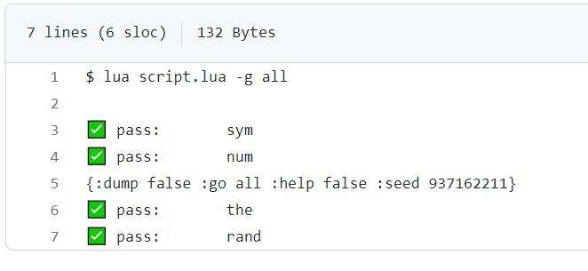
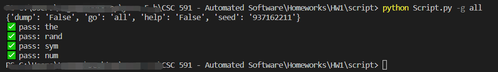

# README
## This is the README file of HW1-script (CSC 591, 2023)
There are some classes and their basic functions defined:

Classes:
* NUM
* SYM

Some functions:
* Random generators
* List
* String

And some test examples

## Result:
* [Expected result](https://github.com/timm/tested/blob/main/etc/out/script.out):

* Result:
* [result](./etc/out/script.out):

## Contributors:
* Jiayuan Huang [jhuang52]
* Mengzhe Wang [mwang39]
* Yuheng Zhu [yzhu63]
